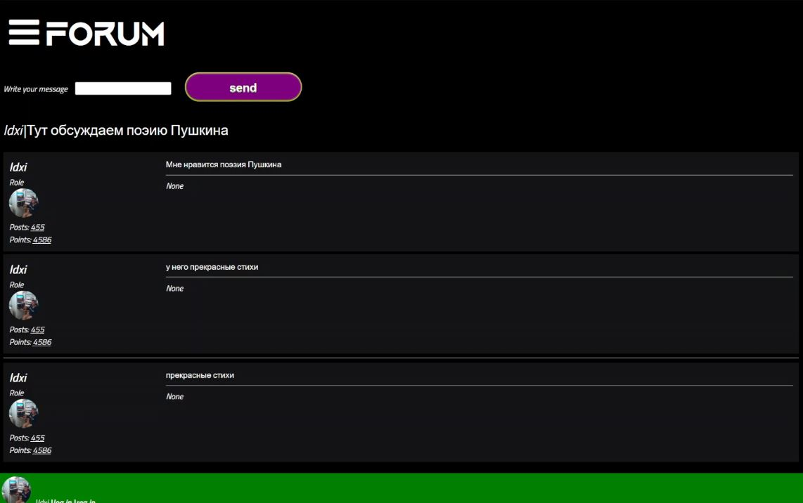

<H3 align="center">Object-Oriented Flask Forum </H3>
<hr>
I present to you my own web forum. You can register on it, create your own threads, and write messages in them that will appear in real-time without refreshing the page.



<H4>About the project structure</H4>
..OFF<p>
└───classes<p>
&emsp;├───media<p>
&emsp;├───static<p>
&emsp;├───templates<p>
This forum uses a class system to make the project safe and easy to maintain. All parts of the application (logger, database, business logic) are implemented as classes. When the application is started, the user passes data to the business logic, which starts web sockets and uses parts of the application to respond to incoming requests.

<H4>Classes</H4>

<ol>
 <li>sql_lite3_db & PostgresDb - responsible for interacting with the database, executing the given query, and returning the response. sqlite3_db takes only the database name, PostgresDb takes the port, password, database name, and host. Both classes have the method execute_query(), which takes a query string to the database and returns the query result. </li>
 <li>
 
 txt_log & json_log - log information provided in files. Both classes take the file name (filename) and the path to it (path) as input. They have the log_message() method, which takes text as input.

 </li>

 <li>
server - a class representing the business logic, 
accepting requests and starting the main application loop. 
Takes class_logger - logger class, 
db - database class, frm - forum class, 
prt - port on which the application will accept requests, 
dbg - boolean value determining the application's debugging mode.
forum - responsible for threads, takes db - database,
name - name. Has methods all() - returns all threads ever created, 
get - get a thread by its id,
delete - delete a thread, update - update thread information.
 </li>


 <H4>Containerization of the application</H4>
 In the application folder, there is a Dockerfile. If you are using PostgresSQL, you need to set environment variables 
 from which information for connecting to the database is taken.
 <p>
 Execute in the application folder: 

 ```
 sudo docker build - t forum .
 ```
 
 Once the build is complete, execute:

 ```
 sudo docker run forum
 ```

<H4> Working with in config </H4>
 If you want configure OFF, you need to find readme.md in root of OFF
 Variables in config:
 
 port - set the port of server
 host - set the adress of server

 user (If you use postrgres DB) - define name of postgres database username
 name (If you use postgtres Name) - set name of postgrses data base

 forum_name - set the name of forum on page
 is_debug - on/off debug mode of server. In the production better use "False"

<h4> Working with postgres DB: </h4>

If you want to  use postgres db, you need to do this steps:

<ol>
<li>
set variables of DB in config.py
</li>
<li>
Change <code> db = sql_lite3_db(name)</code> on <code>PostgresDb(port, password, user, name, host) </code> in main.py
</li>
<li>
run the server!
</li>


</ol>